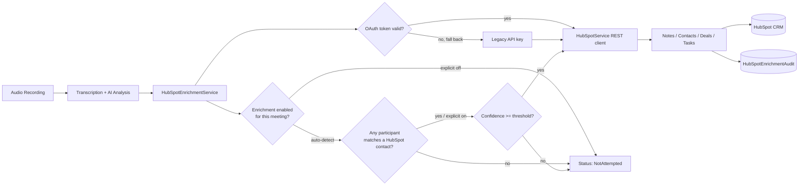

# Automated CRM Enrichment via HubSpot Integration

**Stack:** ASP.NET Core, PostgreSQL (JSONB), Next.js/React, HubSpot REST API v3 + OAuth 2.0
**Initial implementation:** January 2025 (API-key auth)
**Since extended with:** OAuth 2.0, per-meeting status tracking, audit logging, and retry support

## Overview

This integration connects the AI meeting-transcription pipeline to HubSpot CRM. When a sales call or meeting is recorded and transcribed, the system extracts sentiment, pain points, action items, and deal risk, then pushes that into HubSpot as timeline notes, contact/deal property updates, and tasks. No manual data entry required.

The integration consists of an OAuth-based API client, an orchestration/enrichment service, a background token-refresh worker, an audit log, a multi-tenant settings model, and a configuration UI - roughly 2,770 lines across the three main backend files, plus the OAuth service, token-refresh worker, and frontend settings page.

Manually logging call takeaways into HubSpot wasn't happening consistently, so most of what the AI extracted went unused. This automates that step, but only writes to HubSpot once the AI's confidence in what it extracted is high enough - the system is not meant to guess on a customer's CRM data.

## Table of Contents
- [Problem](#problem)
- [Architecture](#architecture)
- [Design Decisions & Trade-offs](#design-decisions--trade-offs)
- [Core Features](#core-features)
- [Implementation Highlights](#implementation-highlights)
- [Data Model](#data-model)
- [Security & Multi-Tenancy](#security--multi-tenancy)
- [Testing Strategy](#testing-strategy)
- [Current State](#current-state)
- [Potential Changes](#potential-changes)

## Problem

The product already records and transcribes sales calls, then runs AI analysis to pull out sentiment, pain points, risks and action items - but all of that stayed trapped inside the app. Reps still had to manually retype takeaways into HubSpot, which is exactly the busywork this product is supposed to get rid of.

Goal: once a meeting finishes processing, the relevant insights should show up in HubSpot on their own. No one touching a keyboard, and nothing speculative getting written into a system of record.

## Architecture



It's built around four pieces:

- **API client** - `HubSpotService.cs` (619 lines), a typed wrapper over HubSpot REST v3: contacts, deals, notes, meeting engagements, tasks, file uploads.
- **OAuth layer** - `HubSpotOAuthService.cs` handles the authorization-code exchange and token refresh; a separate `HubSpotTokenRefreshService` (a `BackgroundService`) polls every 30 minutes and proactively refreshes any token expiring within the next hour, so a rep's connection doesn't silently die mid-day.
- **Orchestration** - `HubSpotEnrichmentService.cs` (1,121 lines). Resolves an OAuth token (falling back to a legacy API key for orgs that haven't migrated), loads meeting data, decides whether enrichment should run at all, checks the confidence threshold, then runs each enabled feature and records the outcome.
- **Delivery** - `HubSpotIntegrationController.cs` (1,029 lines, 15 endpoints) plus a Next.js settings page, covering the OAuth flow, legacy connect/disconnect, settings CRUD, presets, connection testing, stats, and per-meeting retry/history.

The hook into the transcription pipeline is a single call to `EnrichFromMeetingAnalysisAsync`, made right after AI analysis finishes. The pipeline itself has no idea HubSpot exists.

## Design Decisions & Trade-offs

The integration started with a per-organization API key. That's simple to wire up, but it means one shared credential for the whole org, no per-user audit trail, and a key that silently keeps working (or silently breaks) with no owner. Moving to OAuth 2.0 ties the connection to the user who authorized it and gives HubSpot-side scoping, at the cost of needing a token-refresh story. Rather than force every existing org to migrate on a deadline, `HubSpotEnrichmentService` tries an OAuth token first and only falls back to the legacy API key if no active token exists - so the rollout didn't require a breaking cutover.

Token refresh runs as its own background worker rather than refreshing lazily on each API call. Checking every 30 minutes for tokens expiring within the hour means a token is refreshed before anything user-facing needs it, instead of the first request after expiry paying a refresh round-trip (or failing).

Every enrichment path checks `MinimumConfidenceScore` (80% by default, tunable per preset) before touching HubSpot. Writing to someone's CRM isn't a low-stakes operation - a wrong guess in a note is annoying, but a wrong guess that silently overwrites a deal property undermines trust in the whole integration. So it fails closed: nothing gets written unless the AI is confident enough.

Whether enrichment runs for a given meeting isn't just a global on/off switch. Each meeting has a nullable `HubSpotEnrichmentEnabled` flag: explicitly true or false, or null for auto-detect, in which case the service checks whether any meeting participant matches an existing HubSpot contact (by email, then by name) before bothering to enrich. That avoids creating noise in HubSpot for calls with people who aren't in the CRM at all.

Each enrichment attempt (note, contact update, deal update, task) is wrapped and logged to a `HubSpotEnrichmentAudit` table with the HubSpot object ID, HTTP status, error message, and retry count. The meeting itself carries an overall status - NotAttempted, InProgress, Completed, PartiallyCompleted, or Failed - so a partial failure (say, the note succeeds but the deal update doesn't) is visible and re-triggerable instead of being an opaque all-or-nothing result buried in a log file.

Settings are stored as a single `jsonb` column rather than a pile of extra tables. The settings model kept changing shape early on, and JSONB let that happen without a migration every time it grew. Three presets - Conservative, Balanced, Aggressive - give a sane default (they also carry different confidence thresholds: 0.9, 0.8, and 0.75 respectively) without forcing every admin to reason through each toggle individually.

HubSpot's v3 associations API also expects numeric type IDs (202 for contact-note, 204 for contact-task, 206 for deal-meeting, 214 for deal-note, 216 for deal-task) instead of named constants, which is an easy detail to get wrong. Those are centralized in one helper instead of being repeated as magic numbers everywhere.

## Core Features

| # | Feature | Trigger | What it writes to HubSpot |
|---|---|---|---|
| 1 | **Meeting notes** | Meeting qualifies for enrichment | A HubSpot meeting engagement with the AI summary, linked to matched participant contacts |
| 2 | **Contact enrichment** | Confidence ≥ threshold | `pain_points`, `budget_discussed`, `timeline_discussed`, plus org-configurable custom fields |
| 3 | **Deal enrichment** | Confidence ≥ threshold, deal exists for contact | `deal_health_score`, `risk_factors`, `next_steps`, `last_meeting_date` |
| 4 | **Task automation** | Action items extracted | One task per action item, due date = meeting date + N days, optional host assignment, optional high-priority-only filter |

Contact matching tries email first (`GetContactByEmailAsync`), then falls back to a name search (`SearchContactByNameAsync`) if no email match is found - useful for meetings where a participant's email wasn't captured cleanly.

Each meeting also gets a retry path: `POST meetings/{meetingId}/retry` re-runs enrichment (via a `forceRetry` flag) without waiting for the meeting to be reprocessed end-to-end, and `GET meetings/{meetingId}/enrichment-history` surfaces the audit trail for that meeting so a failed contact update, for example, can be diagnosed and re-run on its own.

Two things are stubbed out but not shipped: automatic deal-stage progression and auto-creating HubSpot contacts for unrecognized participants. Both need more product input before it's safe to let the system mutate pipeline stage or create new CRM records on its own.

## Implementation Highlights

**Auth resolution with a legacy fallback.** Before doing anything else, the orchestrator resolves a valid OAuth token and only drops back to the API key path if none exists:

```csharp
var (accessToken, userId) = await GetValidAccessTokenAsync(organizationId);
if (string.IsNullOrEmpty(accessToken))
{
    // Fallback to legacy API key if no OAuth token (for backwards compatibility)
    var apiKey = await GetApiKeyAsync(organizationId);
    if (string.IsNullOrEmpty(apiKey))
    {
        await UpdateMeetingEnrichmentStatusAsync(meetingId, HubSpotEnrichmentStatus.Failed);
        return;
    }
    _hubSpotService.SetApiKey(apiKey);
}
else
{
    _hubSpotService.SetApiKey(accessToken);
}
```

**Per-feature tracking.** Each enabled feature runs through a shared `TrackEnrichmentAsync` wrapper that records success/failure to the audit table, and the meeting's overall status reflects whether everything succeeded, partially succeeded, or failed outright:

```csharp
if (settings.AutoCreateMeetingNotes)
{
    var success = await TrackEnrichmentAsync(meetingId, "MeetingNote",
        async () => await CreateMeetingNotesInternalAsync(meetingData, settings));
    if (success) successCount++; else failureCount++;
}
// ...same pattern for ContactEnrichment, DealEnrichment, TaskCreation

if (failureCount == 0 && successCount > 0)
    await UpdateMeetingEnrichmentStatusAsync(meetingId, HubSpotEnrichmentStatus.Completed);
else if (successCount > 0 && failureCount > 0)
    await UpdateMeetingEnrichmentStatusAsync(meetingId, HubSpotEnrichmentStatus.PartiallyCompleted);
else if (failureCount > 0)
    await UpdateMeetingEnrichmentStatusAsync(meetingId, HubSpotEnrichmentStatus.Failed);
```

**Pipeline hook.** The call site wraps the whole thing in try/catch so a HubSpot failure never fails meeting analysis itself:

```csharp
try
{
    await _hubSpotEnrichmentService.EnrichFromMeetingAnalysisAsync(
        transcript.MeetingId.Value, organizationId);
}
catch (Exception ex)
{
    _logger.LogError(ex, "HubSpot enrichment failed for meeting {MeetingId} - continuing",
        transcript.MeetingId);
}
```

**API surface.** `/api/organization/integrations/hubspot` exposes 15 endpoints: the OAuth flow (`oauth/authorize`, `oauth/callback`, `oauth/status`, `oauth/disconnect`), the legacy API-key flow (`connect`, `disconnect`), settings CRUD and presets (`settings`, `settings/preset`), diagnostics (`test-connection`, `stats`), per-meeting operations (`meetings/{id}/retry`, `meetings/{id}/enrichment-history`), and property discovery (`properties/contacts`, `properties/deals`).

**Frontend.** The settings page at `/dashboard/settings/integrations/hubspot` drives the OAuth popup flow (opens the HubSpot authorization window, polls `oauth/status` until it reports connected), shows connection health and presets, and falls back to a legacy connect form when OAuth isn't configured.

## Data Model

```sql
-- Legacy/simple path: one row per org, either API key or (historically) inline settings
CREATE TABLE "OrganizationIntegrations" (
    "Id" uuid PRIMARY KEY,
    "OrganizationId" text NOT NULL,
    "Platform" text NOT NULL,          -- 'HubSpot'
    "IsEnabled" boolean NOT NULL,
    "ApiKey" text,                     -- legacy auth path
    "LastVerifiedAt" timestamp,
    "CreatedAt" timestamp NOT NULL,
    "Settings" jsonb                   -- HubSpotIntegrationSettings
);

-- OAuth path: one row per user per org
CREATE TABLE integrations."HubSpotUserTokens" (
    "Id" uuid PRIMARY KEY,
    "UserId" uuid NOT NULL,
    "OrganizationId" varchar(255) NOT NULL,
    "HubSpotAccountId" varchar(100),
    "AccessToken" varchar(2000) NOT NULL,
    "RefreshToken" varchar(2000) NOT NULL,
    "TokenExpiresAt" timestamp NOT NULL,
    "Scope" varchar(500),
    "IsActive" boolean NOT NULL
);

-- Audit trail: one row per enrichment attempt (note/contact/deal/task)
CREATE TABLE integrations."HubSpotEnrichmentAudits" (
    "Id" uuid PRIMARY KEY,
    "MeetingId" int NOT NULL,
    "EnrichmentType" varchar(50) NOT NULL,   -- Note, ContactUpdate, DealUpdate, TaskCreation
    "HubSpotObjectId" varchar(100),
    "Success" boolean NOT NULL,
    "HttpStatusCode" int,
    "ErrorMessage" text,
    "RetryCount" int NOT NULL DEFAULT 0,
    "CreatedAt" timestamp NOT NULL
);
```

```json
{
  "Enabled": true,
  "MinimumConfidenceScore": 0.8,
  "AutoCreateMeetingNotes": true,
  "AutoEnrichContacts": true,
  "AutoEnrichDeals": true,
  "AutoCreateTasks": true,
  "AssignTasksToHost": true,
  "DefaultTaskDueDateDays": 7,
  "OnlyCreateHighPriorityTasks": false,
  "ContactPropertiesToUpdate": ["pain_points", "budget_discussed", "timeline_discussed"],
  "DealPropertiesToUpdate": ["deal_health_score", "risk_factors", "next_steps"],
  "CustomFieldMappings": { "budget_discussed": "deal_budget_confirmed" }
}
```

The settings model also has an approval-workflow layer (`ApprovalWebhookUrl`, `ApproverUserIds`) for orgs that want a human to sign off before certain updates go out, on top of the confidence gate.

## Security & Multi-Tenancy

Every endpoint requires a valid JWT, and organization context comes from Clerk's nested `o` claim rather than anything the client sends. Settings, OAuth tokens, enrichment runs, and audit records are all scoped to `OrganizationId` (and, for tokens, `UserId`), so one org can't read or write another org's HubSpot configuration or connection.

OAuth access and refresh tokens are stored server-side only and never returned to the frontend; the legacy API key path is retained for backward compatibility but is being phased out in favor of OAuth. Raw transcripts never leave the system - only the derived insights (sentiment, pain points, action items) that the org has opted into sharing actually get sent to HubSpot.

## Testing Strategy

Documented in a dedicated testing guide covering:
1. HubSpot sandbox setup (private app + required scopes: contacts, deals, notes, timeline)
2. Connection verification via the `/test-connection` endpoint (or the OAuth popup flow end-to-end)
3. End-to-end run: process a real recording, then verify in HubSpot that the meeting engagement, contact properties, deal properties, and tasks all appear correctly
4. Failure-path checks: confirming a bad token or API error lands in `HubSpotEnrichmentAudit` with the right status and error message, and that `meetings/{id}/retry` recovers it
5. A troubleshooting checklist (detailed logging flag, participant email/name matching, confidence threshold, analysis completion state)

## Current State

The three main backend files run to roughly 2,770 lines combined (client, orchestrator, controller), plus the OAuth service, token-refresh worker, and frontend settings page on top of that. Each qualifying meeting triggers up to four automated CRM actions (note, contact update, deal update, tasks) that were previously manual, with per-attempt audit records instead of a single opaque success/fail outcome. Enrichment failures are isolated and logged rather than blocking transcript processing, so a HubSpot outage or expired token can't take down the core pipeline - and thanks to the retry endpoint, a failed enrichment doesn't need the whole meeting reprocessed to fix.

## Potential Changes

- Finish migrating orgs off the legacy API-key path now that OAuth is stable, and drop the fallback once adoption is complete.
- Move enrichment behind a background job queue instead of an inline call from the pipeline - HubSpot's free-tier rate limit (100 calls/10s) will start to bite at higher volume.
- Build out the approval-workflow fields (`ApprovalWebhookUrl`, `ApproverUserIds`) that already exist on the settings model but don't have a UI or notification path yet.
- Ship the contact-discovery flow (auto-creating HubSpot contacts for unrecognized participants) and deal-stage automation, both currently stubbed.

