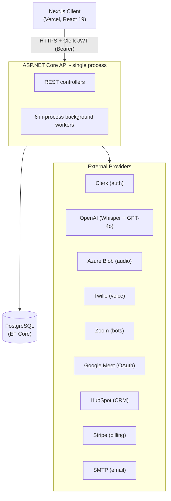
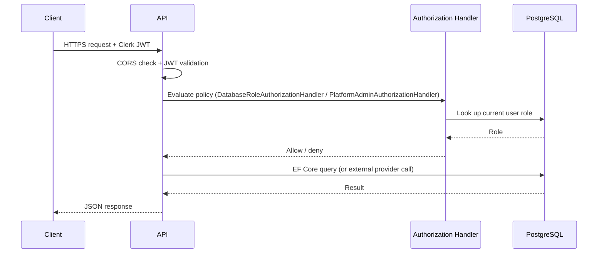
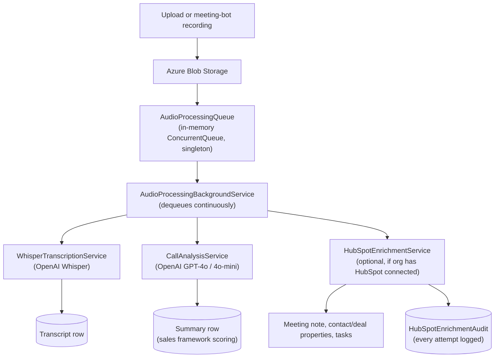

# System Architecture

Backend: ASP.NET Core 8 Web API (`apis/domain-api`). Frontend: Next.js 15 / React 19 (`transcription-client`). Database: PostgreSQL via EF Core. Multi-tenant (organization-scoped) SaaS platform for call/meeting transcription and AI sales analysis, with CRM and telephony integrations.

## Architecture Overview

There is no separate worker service or message broker. Background processing runs as `IHostedService`/`BackgroundService` instances inside the same API process: `AudioProcessingBackgroundService`, `ProviderHealthService`, `GoogleMeetPollingService`, `GoogleMeetRecordingProcessingService`, `WebhookRetryService`, and `HubSpotTokenRefreshService`.

## Components

| Component | Responsibility |
|---|---|
| **Next.js client** | UI, Clerk session management, calls the API with a bearer token |
| **API controllers** | Request validation, org/role authorization, orchestration (`Controllers/`) |
| **Business services** | Billing, sales-framework analysis, audio processing, integrations (`Services/`) |
| **Background workers** | Queue draining, polling, token refresh, retry, health checks - all in-process |
| **PostgreSQL** | System of record: users, organizations, roles, transcripts, calls, billing, integration state |
| **Azure Blob Storage** (or local disk in dev) | Raw audio file storage |
| **External providers** | Clerk (auth/orgs), OpenAI (transcription + analysis), Twilio (voice), Zoom/Google Meet (meeting capture), HubSpot (CRM sync), Stripe (billing), SMTP (email) |

## Data Flow

### Authenticated request

Authorization is evaluated per-request against the database (not just the JWT), so a role change takes effect immediately without waiting for token refresh.

### Audio/meeting processing pipeline

Google Meet and Zoom recordings enter the same pipeline via their own polling/bot services (`GoogleMeetPollingService`, `GoogleMeetRecordingProcessingService`, Zoom bot), which drop a job onto the same `AudioProcessingQueue` once a recording is available.

## Authentication

- **Identity provider:** Clerk. The API validates JWTs issued by Clerk (`Authority` = Clerk instance, `Audience` = `dotnet-api`) via `JwtBearerDefaults`.
- **Authorization is database-driven, not claims-driven.** A custom `DatabaseRoleAuthorizationHandler` checks the caller's role against the `Users`/`Roles` tables on every request, so role changes apply immediately. A separate `PlatformAdminAuthorizationHandler` gates internal platform-admin endpoints, independent of any organization membership.
- **Policies in use:**

  | Policy | Allowed roles |
  |---|---|
  | `PlatformOwner` | Platform admin (not org-scoped) |
  | `OrgAdminOnly` | `Admin` |
  | `TeamManagement` | `Admin`, `SalesLead` |
  | `OrgMember` | `Admin`, `SalesLead`, `Sales` |

  Three older policies (`AdminOnly`, `AdminOrSalesLead`, `MemberOrAbove`) are equivalent to the ones above and are marked in code as legacy, pending removal once call sites are migrated.
- **CORS** is locked to `localhost` and a specific Vercel deployment (`ai-sales-platform-client*.vercel.app`) - not a wildcard.
- Middleware order matters: CORS → HSTS/HTTPS redirect (production only) → token-refresh middleware → `UseAuthentication` → `UseAuthorization`.

## Failure Scenarios

| Scenario | Behavior |
|---|---|
| API process restarts while audio jobs are queued | Jobs are lost. `AudioProcessingQueue` is an in-memory `ConcurrentQueue`, not backed by a durable store - a crash or deploy mid-queue drops unprocessed jobs. |
| HubSpot API/token failure during enrichment | Isolated per feature. Each enrichment step (note/contact/deal/task) is tracked independently in `HubSpotEnrichmentAudit`; a failure in one doesn't block the others or the meeting pipeline, and it's retryable via `POST meetings/{id}/retry`. |
| Webhook delivery failure (e.g. Clerk webhook side-effects) | `WebhookRetryService` re-checks every 5 minutes, up to 10 attempts, starting 30 seconds after app startup. |
| OpenAI billing/quota errors spike | Tracked by `IOpenAiFailureTracker`; `ProviderHealthService` alerts once the failure count in a rolling window crosses a configured threshold. |
| Twilio account balance runs low | `ProviderHealthService` polls the Twilio balance on an interval and alerts before it hits zero (which would start failing outbound/inbound calls). |
| Repeated alert conditions | Both Twilio and OpenAI alerts have a cooldown window so the same incident doesn't spam the alert channel. |

## Deployment

Two deployment paths exist in the repo:

- **Local/dev:** `docker-compose.yml` at the repo root runs Postgres, the API, the Next.js client, and Adminer together on one host.
- **Production:** the API is deployed to **Azure App Service**; `set-azure-appsettings.ps1` reads local `dotnet user-secrets` and pushes them to the App Service's configuration in one pass (converting `:` to `__` for Azure's env-var format). The frontend is deployed separately to **Vercel**, which is why CORS is scoped to a specific `*.vercel.app` host rather than the API's own domain.
- Swagger/OpenAPI UI is only enabled in the `Development` environment. HSTS and HTTPS redirection are only enforced in `Production`.

## Monitoring

- **Structured logging:** Serilog writes to the console and to a rolling daily file (`logs/domain-api-.log`, 30-day retention) so failures are queryable after the fact instead of only visible in live console output.
- **Provider health watchdog:** `ProviderHealthService` (a `BackgroundService`) periodically checks Twilio account balance and OpenAI failure rate, and posts to a configurable webhook URL (`ProviderAlerting:WebhookUrl`, Slack-compatible payload) when either crosses a threshold.
- **Health endpoint:** `GET /health` returns a simple liveness payload (`status`, `timestamp`, `service`) with no authentication required, for uptime checks.
- **Enrichment audit trail:** `HubSpotEnrichmentAudit` records the outcome (success/failure, HTTP status, error message, retry count) of every CRM write, giving per-meeting visibility into a specific integration without needing to grep logs.
